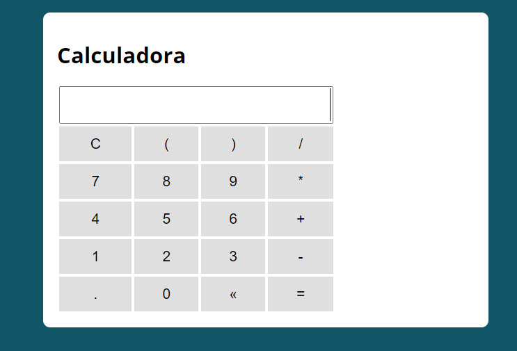

# calculadora
Projeto que utiliza JavaScript para simular a calculadora do google.

## Minha aplicação:

## Sobre a aplicação:

Projeto que simula a maioria das funcionalidades da calculadora do google, capturando as teclas que o usuário clica 
tanto no teclado como no layout da própria calculadora e realizando as operações matemáticas por meio do JavaScript.

## Por que essa aplicão?

Esse porjeto foi ensinado em um workshop da empresa b7web, e realizado com o intuito de desenvolver minha lógica de programação e o 
portfólio pessoal.
